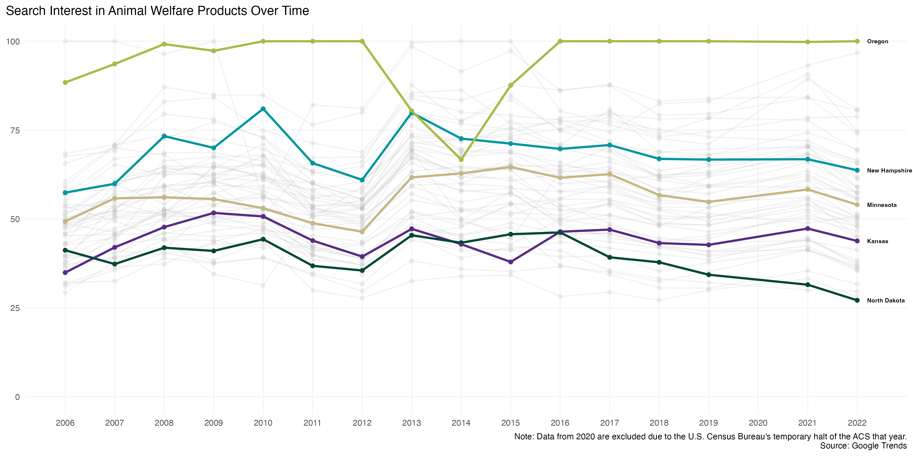
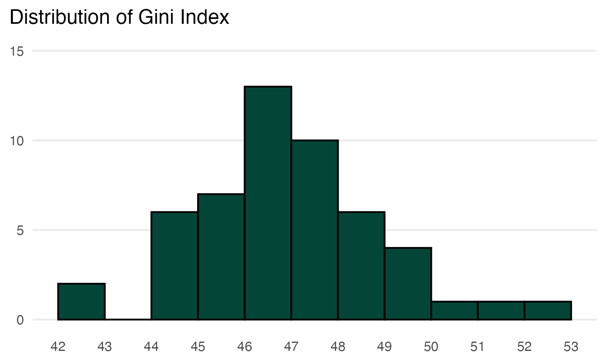
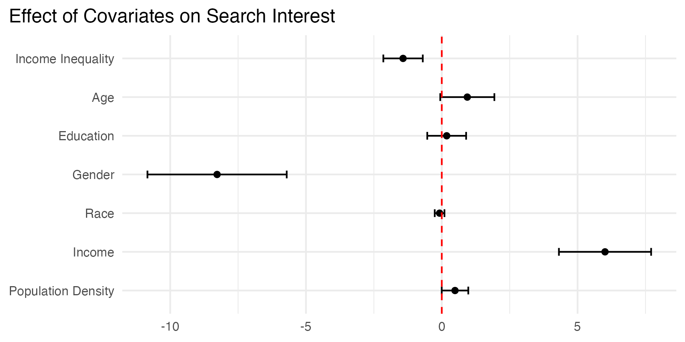

# Objective
This project is a part of the Undergraduate Summer Research Internship (USRI) program at Ivey Business School. The repository contains the data and analysis code for the research project "Income Inequality and Search Interest in Animal Welfare Products." The project investigates the relationship between income inequality and the search interest in animal welfare-related keywords across the United States.

## Summary
Data was collected spanning from 2006 to 2022 using the R programming language and various APIs. The data for the year 2020 were excluded due to the U.S. Census Bureau's temporary halt of the ACS that year. Our dataset includes 51 states, encompassing Washington D.C., and 16 years for a total of 816 observations.

| **Source**                        | **Data**                                                                                                         |
|:----------------------------------|:----------------------------------------------------------------------------------------------------------------|
| Google Trends                     | [Search Interest data](https://trends.google.com/)                                                               |
| Social Explorer                   | [Gini Index data](https://www.socialexplorer.com/)                                                               |
| American Community Survey (ACS)   | [Demographic and Socioeconomic data](https://www.census.gov/programs-surveys/acs)                                |

# Gallery

## [Random Intercepts Slopes Plot] [Codes](06-data-virtualization.R#L317)

## [Search Interest in Animal Welfare Products Over Time] [Codes](06-data-virtualization.R#L147)

## [Distribution of Gini Index] [Codes](06-data-virtualization.R#L243)

## [Effect of Covariates on Search Interest] [Codes](06-data-virtualization.R#L215)

# Future Steps
Google Trends provides valuable insights into public interest and behavior by analyzing search query data. In the future, we can expand the range of topics beyond animal welfare to include areas such as environmental issues, public health, and economic indicators. This can help identify broader trends in public interest. In addition, we can explore correlations between Google Trends data and other datasets (e.g., social media activity, economic indicators, public health data) to identify potential relationships and causative factors.
